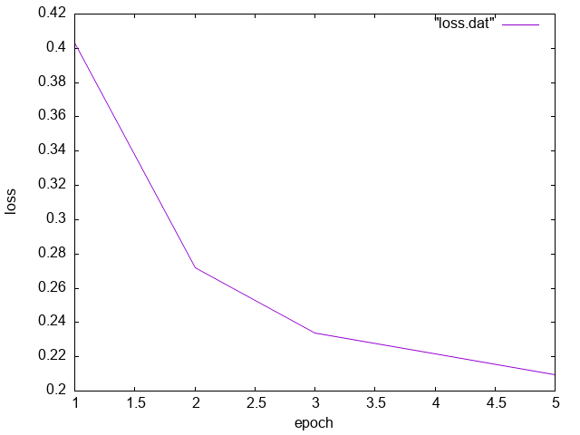

# Transfer learning

Instructional example how to replace the standard classifier with a
custom one while using the pre-trained weights for the feature detector and
keeping the features frozen.

Learns to distinguish between cats and dogs.


## Load the dataset from Kaggle

```
pip install kagglehub
python get_cats_dogs.py
```

## Run the training

```
cmake .
make
./transfer
```

The output is the current training loss to show that its converging:

```
Epoch [1/50], Loss: 0.409403
Epoch [2/50], Loss: 0.268874
```

The loss is saved into the file `loss.dat`.


